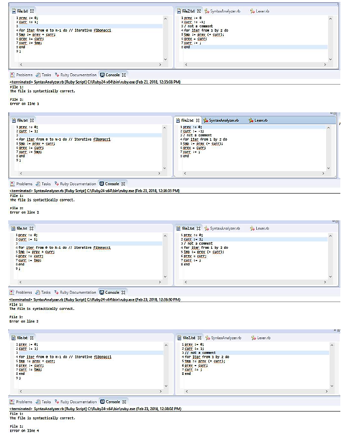
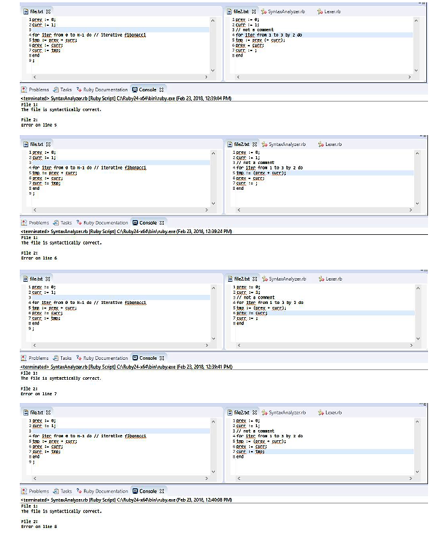
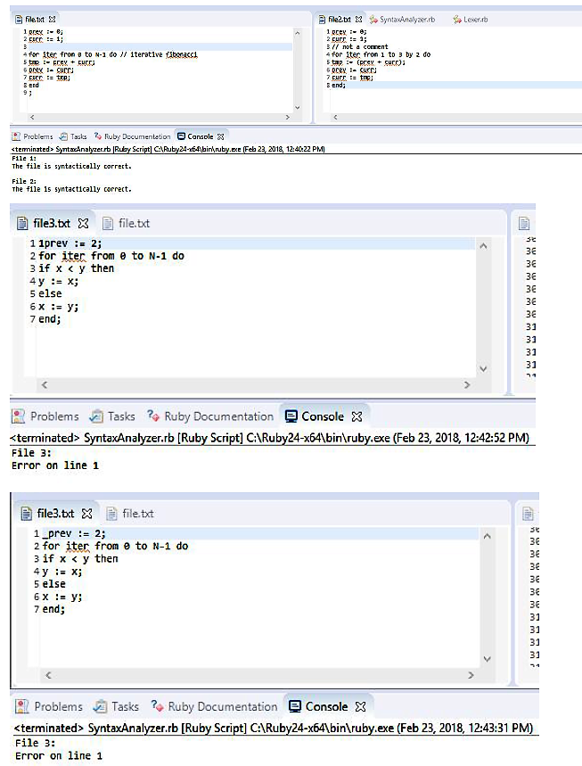
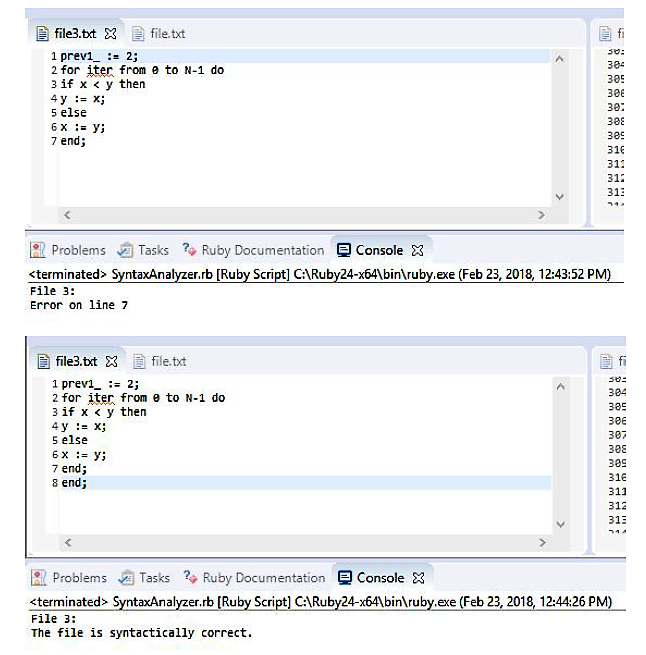

# Lexer and Syntax Analyzer in Ruby
1. Project title
    * Lexer and Syntax Analyzer in Ruby
2. Project Description
    * A lexer for a program language definition. Returns the symbol for the next sequential token. The lexer returns the textual
representation of the token and consumes the current token. The Lexer tacks an
EOF (end of file) token to the end of the list of tokens. The syntax analyzer retrieves the tokens at each step. If the EOF
token is reached with no issue, the program should report that the file is syntactically correct. Otherwise,
if an error is found, an appropriate error message is displayed.
3. Author
    * John Stephenson
4. Screenshots/Sample Session
    * Test Cases
        *    
        *    
        *    
        *    
5. Contact Information
    * johnds39@uab.edu
